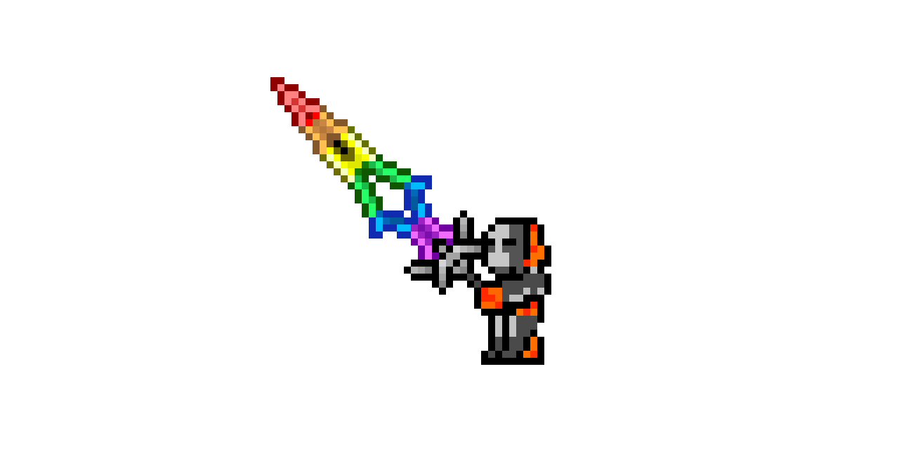
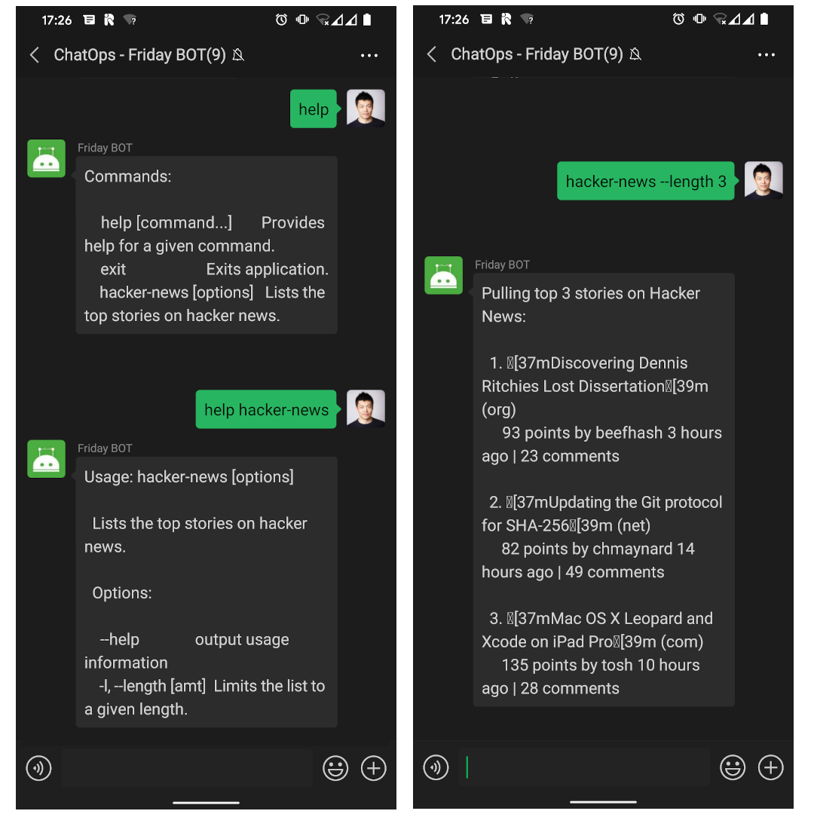

# wechaty-vorpal

[](https://github.com/wechaty/wechaty-vorpal)
[](https://github.com/wechaty/wechaty-vorpal/actions?query=workflow%3ANPM)
 [](https://www.npmjs.com/package/wechaty-vorpal)

Extensible Interactive CLI Plugin for Wechaty ChatOps, Powered by Vorpal.

[](https://github.com/wechaty/wechaty-vorpal)

> Image: [rainbow sword](http://pixelartmaker.com/art/3008b950f5ab168)

[](https://github.com/Wechaty/wechaty)
[](https://www.typescriptlang.org/)

## Usage

```ts
import { Wechaty }        from 'wechaty'
import { WechatyVorpal }  from 'wechaty-vorpal'
import hackerNews         from 'vorpal-hacker-news'

const wechaty = new Wechaty()

wechaty.use(
  WechatyVorpal({
    use: hackerNews,
  }),
)

wechaty.start()
```

See: [wechaty-vorpal-contrib](https://github.com/wechaty/wechaty-vorpal-contrib) for more Wechaty Vorpal Extension CLI for Chatbots.

## Demo



> help

```sh
Commands:

    help [command...]       Provides help for a given command.
    exit                    Exits application.
    hacker-news [options]   Lists the top stories on hacker news.
```

> help hacker-news

```sh
Usage: hacker-news [options]

  Lists the top stories on hacker news.

  Options:

    --help              output usage information
    -l, --length [amt]  Limits the list to a given length.
```

> hacker-news --length 3

```sh
Pulling top 3 stories on Hacker News:

  1. Discovering Dennis Ritchies Lost Dissertation (org)
     93 points by beefhash 3 hours ago | 23 comments

  2. Updating the Git protocol for SHA-256 (net)
     81 points by chmaynard 14 hours ago | 48 comments

  3. Mac OS X Leopard and Xcode on iPad Pro (com)
     134 points by tosh 10 hours ago | 28 comments
```

## Resources

1. [Creating Node.js Command Line Utilities to Improve Your Workflow](https://www.telerik.com/blogs/creating-node-js-command-line-utilities-improve-workflow)
1. [vantge - Distributed, realtime CLI for live Node apps.](https://github.com/dthree/vantage)
1. [vorpal - Node's framework for interactive CLIs](https://github.com/dthree/vorpal)
1. [vorpal-regorged - Conquer the command-line. ⚔️](https://github.com/vorpaljs-reforged/vorpal): This is a Fork aiming at reforging vorpal into typescript, and bringing a 2.0
1. [bandersnatch - Super lightweight and friendly CLI scaffolding for Node.js programs.](https://github.com/hongaar/bandersnatch)

## History

### v0.4 (July 10, 2020)

1. Support Input, Output, and Error (powered by Observable)
    1. `this.stdout.next(...)`
    1. `this.stderr.next(...)`
    1. `this.stdin.subscribe(msg => {...})`.
1. Support send any supported `SayableMessage` type of message to the user
    1. `string`
    1. `FileBox`
    1. `Contact`
    1. `UrlLink`
    1. etc...
1. Support get the `message` instance which invoked this command
    1. `this.message`
1. Support `ask()` to ask user question and get the answer back!

### v0.3 (July 7, 2020)

Inherit the TypeScript source code from the [Vorpal Reforged](https://github.com/vorpaljs-reforged/vorpal) ([MIT License](src/vorpal/LICENSE)) so that we can refactor it to fit the Chatbot environment better.

### v0.2 (Jun 19, 2020)

Init the first version of Vorpal Wechaty Plugin for managing ChatOps Commands

## Contributors

[](https://sourcerer.io/fame/huan/wechaty/wechaty-vorpal/links/0)
[](https://sourcerer.io/fame/huan/wechaty/wechaty-vorpal/links/1)
[](https://sourcerer.io/fame/huan/wechaty/wechaty-vorpal/links/2)
[](https://sourcerer.io/fame/huan/wechaty/wechaty-vorpal/links/3)
[](https://sourcerer.io/fame/huan/wechaty/wechaty-vorpal/links/4)
[](https://sourcerer.io/fame/huan/wechaty/wechaty-vorpal/links/5)
[](https://sourcerer.io/fame/huan/wechaty/wechaty-vorpal/links/6)
[](https://sourcerer.io/fame/huan/wechaty/wechaty-vorpal/links/7)

## Author

[Huan LI](https://github.com/huan) ([李卓桓](http://linkedin.com/in/zixia)), Tencent TVP of Chatbot, \<zixia@zixia.net\>

[](https://stackexchange.com/users/265499)

## Copyright & License

- Code & Docs © 2020 Huan LI (李卓桓) \<zixia@zixia.net\>
- Code released under the Apache-2.0 License
- Docs released under Creative Commons
